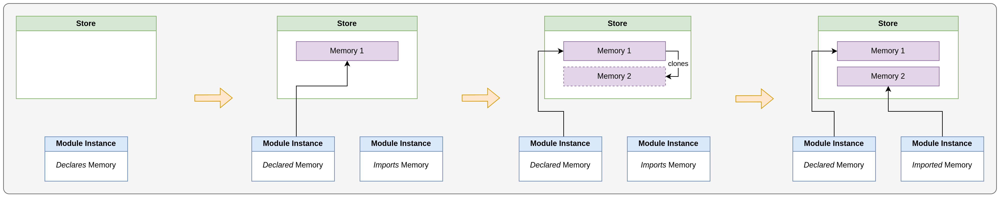

# WebAssembly - The Threads Proposal
This proposal represents the foundation of multithreaded WebAssembly. It introduces the _shared linear memory_ type and new operations for _atomic memory access_. An up-to-date overview of the proposal can be viewed [here](https://github.com/WebAssembly/threads/blob/main/proposals/threads/Overview.md).

## Shared Linear Memory
A linear memory can now be marked as _shared_ - this holds true for memory __defined as well as imported__ in a module. In contrast to a regular memory, changes to the memory contents can be observed by different agents that have access to this memory.

Note: There is an important difference between _importing_ and _sharing_ a memory instance. When a module imports a _non-shared_ memory, it sees the changes made to the memory up until module instantiation, but recieves a reference to the unique copy of the original memory instance. It can therefore _not see_ the changes made afterwards to the original memory. When a module imports a _shared memory_, the original memory contents are _not copied_, but the module rather recieves a reference to the imported memory instance. This makes concurrent access of multiple agents to the same memory instance possible.

The following figure illustrates how imports of standard memory instances works:


The following figure shows, how shared memory instances are imported:


## Wait and Notify

The notify and wait operators are optimizations over busy-waiting for a value
to change. The operators have sequentially consistent ordering.

Both notify and wait operators trap if the effective address of either operator
is misaligned or out-of-bounds. Wait operators additionally trap if used on an
unshared linear memory. The wait operators require an alignment of their memory
access size. The notify operator requires an alignment of 32 bits.

An example, of how to use these instructions to implement a simple mutex in WebAssembly can be seen [below](#example-taken-from-the-official-overview).

### Wait
The wait operator take three operands: an address operand, an expected value, and a relative timeout in nanoseconds as an `i64`.

When executed, the wait instruction loads a value at a given memory address and compares it to an expected value. If the values are equal, the agent is suspended until woken or an optional timeout expires:

- `memory.atomic.wait32`: Loads a `i32` value from the given address
- `memory.atomic.wait64`: Loads a `i64` value from the given address

### Notify
The notify operator takes two operands: an address operand and a _count_ as an unsigned i32.

The operation will notify as many waiters as are waiting on the same effective address, up to the maximum as specified by _count_.

- `memory.atomic.notify`: notify count threads waiting on the given address via `memory.atomic.wait32` or `memory.atomic.wait64`

## Atomic Memory Access
There are three groups of atmoic memory access instructions introduced in this proposal: _load/store_, _read-modify-write_ and _compare-exchange_. All of those instructions can act on shared and non-shared linear memories. The following descriptions are mainly copied from the official overview:

### Load/Store
There are now atomic counterparts for the regular load and store instructions for 32 and 64 bit numbers: 

  * `i32.atomic.load8_u`: atomically load 1 byte and zero-extend i8 to i32
  * `i32.atomic.load16_u`: atomically load 2 bytes and zero-extend i16 to i32
  * `i32.atomic.load`: atomically load 4 bytes as i32
  * `i64.atomic.load8_u`: atomically load 1 byte and zero-extend i8 to i64
  * `i64.atomic.load16_u`: atomically load 2 bytes and zero-extend i16 to i64
  * `i64.atomic.load32_u`: atomically load 4 bytes and zero-extend i32 to i64
  * `i64.atomic.load`: atomically load 8 bytes as i64
  * `i32.atomic.store8`: wrap i32 to i8 and atomically store 1 byte
  * `i32.atomic.store16`: wrap i32 to i16 and atomically store 2 bytes
  * `i32.atomic.store`: (no conversion) atomically store 4 bytes
  * `i64.atomic.store8`: wrap i64 to i8 and atomically store 1 byte
  * `i64.atomic.store16`: wrap i64 to i16 and atomically store 2 bytes
  * `i64.atomic.store32`: wrap i64 to i32 and atomically store 4 bytes
  * `i64.atomic.store`: (no conversion) atomically store 8 bytes

### Read-Modify-Write

Atomic read-modify-write (RMW) operators atomically read a value from an
address, modify the value, and store the resulting value to the same address.
All RMW operators return the value read from memory before the modify operation
was performed.

The RMW operators have two operands, an address and a value used in the modify
operation. Here is an overview taken from the official document:

| Name | Read (as `read`) | Modify | Write | Return `read` |
| ---- | ---- | ---- | ---- | ---- |
| `i32.atomic.rmw8.add_u` | 1 byte | 8-bit sign-agnostic addition | 1 byte | zero-extended i8 to i32 |
| `i32.atomic.rmw16.add_u` | 2 bytes | 16-bit sign-agnostic addition | 2 bytes | zero-extended i16 to i32 |
| `i32.atomic.rmw.add` | 4 bytes | 32-bit sign-agnostic addition | 4 bytes | as i32 |
| `i64.atomic.rmw8.add_u` | 1 byte | 8-bit sign-agnostic addition | 1 byte | zero-extended i8 to i64 |
| `i64.atomic.rmw16.add_u` | 2 bytes | 16-bit sign-agnostic addition | 2 bytes | zero-extended i16 to i64 |
| `i64.atomic.rmw32.add_u` | 4 bytes | 32-bit sign-agnostic addition | 4 bytes | zero-extended i32 to i64 |
| `i64.atomic.rmw.add` | 8 bytes | 64-bit sign-agnostic addition | 8 bytes | as i64 |
| `i32.atomic.rmw8.sub_u` | 1 byte | 8-bit sign-agnostic subtraction | 1 byte | zero-extended i8 to i32 |
| `i32.atomic.rmw16.sub_u` | 2 bytes | 16-bit sign-agnostic subtraction | 2 bytes | zero-extended i16 to i32 |
| `i32.atomic.rmw.sub` | 4 bytes | 32-bit sign-agnostic subtraction | 4 bytes | as i32 |
| `i64.atomic.rmw8.sub_u` | 1 byte | 8-bit sign-agnostic subtraction | 1 byte | zero-extended i8 to i64 |
| `i64.atomic.rmw16.sub_u` | 2 bytes | 16-bit sign-agnostic subtraction | 2 bytes | zero-extended i16 to i64 |
| `i64.atomic.rmw32.sub_u` | 4 bytes | 32-bit sign-agnostic subtraction | 4 bytes | zero-extended i32 to i64 |
| `i64.atomic.rmw.sub` | 8 bytes | 64-bit sign-agnostic subtraction | 8 bytes | as i64 |
| `i32.atomic.rmw8.and_u` | 1 byte | 8-bit sign-agnostic bitwise and | 1 byte | zero-extended i8 to i32 |
| `i32.atomic.rmw16.and_u` | 2 bytes | 16-bit sign-agnostic bitwise and | 2 bytes | zero-extended i16 to i32 |
| `i32.atomic.rmw.and` | 4 bytes | 32-bit sign-agnostic bitwise and | 4 bytes | as i32 |
| `i64.atomic.rmw8.and_u` | 1 byte | 8-bit sign-agnostic bitwise and | 1 byte | zero-extended i8 to i64 |
| `i64.atomic.rmw16.and_u` | 2 bytes | 16-bit sign-agnostic bitwise and | 2 bytes | zero-extended i16 to i64 |
| `i64.atomic.rmw32.and_u` | 4 bytes | 32-bit sign-agnostic bitwise and | 4 bytes | zero-extended i32 to i64 |
| `i64.atomic.rmw.and` | 8 bytes | 64-bit sign-agnostic bitwise and | 8 bytes | as i64 |
| `i32.atomic.rmw8.or_u` | 1 byte | 8-bit sign-agnostic bitwise inclusive or | 1 byte | zero-extended i8 to i32 |
| `i32.atomic.rmw16.or_u` | 2 bytes | 16-bit sign-agnostic bitwise inclusive or | 2 bytes | zero-extended i16 to i32 |
| `i32.atomic.rmw.or` | 4 bytes | 32-bit sign-agnostic bitwise inclusive or | 4 bytes | as i32 |
| `i64.atomic.rmw8.or_u` | 1 byte | 8-bit sign-agnostic bitwise inclusive or | 1 byte | zero-extended i8 to i64 |
| `i64.atomic.rmw16.or_u` | 2 bytes | 16-bit sign-agnostic bitwise inclusive or | 2 bytes | zero-extended i16 to i64 |
| `i64.atomic.rmw32.or_u` | 4 bytes | 32-bit sign-agnostic bitwise inclusive or | 4 bytes | zero-extended i32 to i64 |
| `i64.atomic.rmw.or` | 8 bytes | 64-bit sign-agnostic bitwise inclusive or | 8 bytes | as i64 |
| `i32.atomic.rmw8.xor_u` | 1 byte | 8-bit sign-agnostic bitwise exclusive or | 1 byte | zero-extended i8 to i32 |
| `i32.atomic.rmw16.xor_u` | 2 bytes | 16-bit sign-agnostic bitwise exclusive or | 2 bytes | zero-extended i16 to i32 |
| `i32.atomic.rmw.xor` | 4 bytes | 32-bit sign-agnostic bitwise exclusive or | 4 bytes | as i32 |
| `i64.atomic.rmw8.xor_u` | 1 byte | 8-bit sign-agnostic bitwise exclusive or | 1 byte | zero-extended i8 to i64 |
| `i64.atomic.rmw16.xor_u` | 2 bytes | 16-bit sign-agnostic bitwise exclusive or | 2 bytes | zero-extended i16 to i64 |
| `i64.atomic.rmw32.xor_u` | 4 bytes | 32-bit sign-agnostic bitwise exclusive or | 4 bytes | zero-extended i32 to i64 |
| `i64.atomic.rmw.xor` | 8 bytes | 64-bit sign-agnostic bitwise exclusive or | 8 bytes | as i64 |
| `i32.atomic.rmw8.xchg_u` | 1 byte | nop | 1 byte | zero-extended i8 to i32 |
| `i32.atomic.rmw16.xchg_u` | 2 bytes | nop | 2 bytes | zero-extended i16 to i32 |
| `i32.atomic.rmw.xchg` | 4 bytes | nop | 4 bytes | as i32 |
| `i64.atomic.rmw8.xchg_u` | 1 byte | nop | 1 byte | zero-extended i8 to i64 |
| `i64.atomic.rmw16.xchg_u` | 2 bytes | nop | 2 bytes | zero-extended i16 to i64 |
| `i64.atomic.rmw32.xchg_u` | 4 bytes | nop | 4 bytes | zero-extended i32 to i64 |
| `i64.atomic.rmw.xchg` | 8 bytes | nop | 8 bytes | as i64 |

### Compare Exchange

The atomic compare exchange operators take three operands: an address, an
`expected` value, and a `replacement` value. If the `loaded` value is equal to
the `expected` value, the `replacement` value is stored to the same memory
address. If the values are not equal, no value is stored. In either case, the
`loaded` value is returned.

| Name | Load (as `loaded`) | Compare `expected` with `loaded` | Conditionally Store `replacement` | Return `loaded` |
| ---- | ---- | ---- | ---- | ---- |
| `i32.atomic.rmw8.cmpxchg_u` | 1 byte | `expected` wrapped from i32 to i8, 8-bit compare equal | wrapped from i32 to i8, store 1 byte | zero-extended from i8 to i32 |
| `i32.atomic.rmw16.cmpxchg_u` | 2 bytes | `expected` wrapped from i32 to i16, 16-bit compare equal | wrapped from i32 to i16, store 2 bytes | zero-extended from i16 to i32 |
| `i32.atomic.rmw.cmpxchg` | 4 bytes | 32-bit compare equal | store 4 bytes | as i32 |
| `i64.atomic.rmw8.cmpxchg_u` | 1 byte | `expected` wrapped from i64 to i8, 8-bit compare equal | wrapped from i64 to i8, store 1 byte | zero-extended from i8 to i64 |
| `i64.atomic.rmw16.cmpxchg_u` | 2 bytes | `expected` wrapped from i64 to i16, 16-bit compare equal | wrapped from i64 to i16, store 2 bytes | zero-extended from i16 to i64 |
| `i64.atomic.rmw32.cmpxchg_u` | 4 bytes | `expected` wrapped from i64 to i32, 32-bit compare equal | wrapped from i64 to i32, store 4 bytes | zero-extended from i32 to i64 |
| `i64.atomic.rmw.cmpxchg` | 8 bytes | 64-bit compare equal | 8 bytes | as i64 |

### Alignment (Important difference to non-atomic memory accesses!)

Unlike normal memory accesses, misaligned atomic accesses trap. For non-atomic
accesses on shared linear memory, misaligned accesses do not trap.

It is a validation error if the alignment field of the memory access immediate
has any other value than the natural alignment for that access size.

## Fence operator

The fence operator, `atomic.fence`, takes no operands, and returns nothing. It is intended to preserve the synchronization guarantees of the [fence operators of higher-level languages](https://en.cppreference.com/w/cpp/atomic/atomic_thread_fence).

Unlike other atomic operators, `atomic.fence` does not target a particular linear memory. It may occur in modules which declare no memory without causing a validation error.

## Example (taken from the official overview):
Here is an example of a naive mutex implemented in WebAssembly. It uses one i32 in linear memory to store the state of the lock. If its value is 0, the mutex is unlocked. If its value is 1, the mutex is locked.

```wasm
(module
  ;; Import 1 page (64Kib) of shared memory.
  (import "env" "memory" (memory 1 1 shared))

  ;; Try to lock a mutex at the given address.
  ;; Returns 1 if the mutex was successfully locked, and 0 otherwise.
  (func $tryLockMutex (export "tryLockMutex")
    (param $mutexAddr i32) (result i32)
    ;; Attempt to grab the mutex. The cmpxchg operation atomically
    ;; does the following:
    ;; - Loads the value at $mutexAddr.
    ;; - If it is 0 (unlocked), set it to 1 (locked).
    ;; - Return the originally loaded value.
    (i32.atomic.rmw.cmpxchg
      (local.get $mutexAddr) ;; mutex address
      (i32.const 0)          ;; expected value (0 => unlocked)
      (i32.const 1))         ;; replacement value (1 => locked)

    ;; The top of the stack is the originally loaded value.
    ;; If it is 0, this means we acquired the mutex. We want to
    ;; return the inverse (1 means mutex acquired), so use i32.eqz
    ;; as a logical not.
    (i32.eqz)
  )

  ;; Lock a mutex at the given address, retrying until successful.
  (func (export "lockMutex")
    (param $mutexAddr i32)
    (block $done
      (loop $retry
        ;; Try to lock the mutex. $tryLockMutex returns 1 if the mutex
        ;; was locked, and 0 otherwise.
        (call $tryLockMutex (local.get $mutexAddr))
        (br_if $done)

        ;; Wait for the other agent to finish with mutex.
        (memory.atomic.wait32
          (local.get $mutexAddr) ;; mutex address
          (i32.const 1)          ;; expected value (1 => locked)
          (i64.const -1))        ;; infinite timeout

        ;; memory.atomic.wait32 returns:
        ;;   0 => "ok", woken by another agent.
        ;;   1 => "not-equal", loaded value != expected value
        ;;   2 => "timed-out", the timeout expired
        ;;
        ;; Since there is an infinite timeout, only 0 or 1 will be returned. In
        ;; either case we should try to acquire the mutex again, so we can
        ;; ignore the result.
        (drop)

        ;; Try to acquire the lock again.
        (br $retry)
      )
    )
  )

  ;; Unlock a mutex at the given address.
  (func (export "unlockMutex")
    (param $mutexAddr i32)
    ;; Unlock the mutex.
    (i32.atomic.store
      (local.get $mutexAddr)     ;; mutex address
      (i32.const 0))             ;; 0 => unlocked

    ;; Notify one agent that is waiting on this lock.
    (drop
      (memory.atomic.notify
        (local.get $mutexAddr)   ;; mutex address
        (i32.const 1)))          ;; notify 1 waiter
  )
)
```